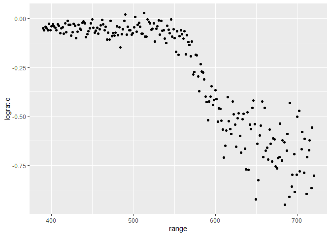
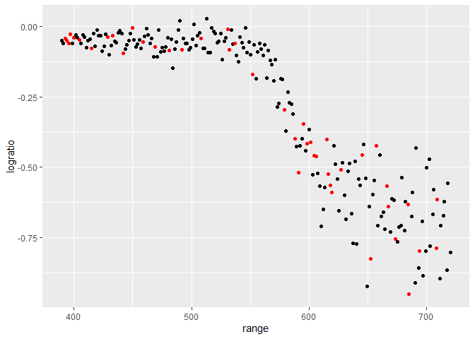
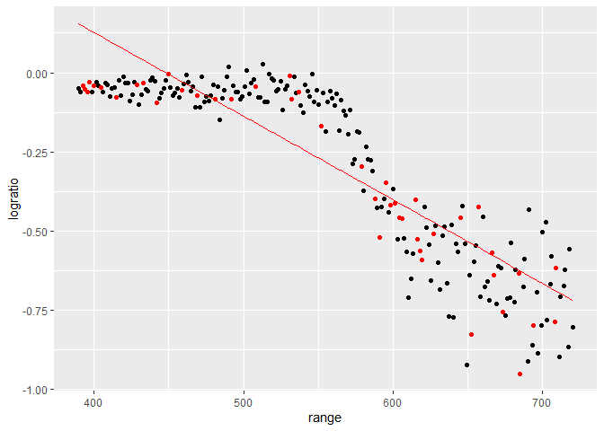
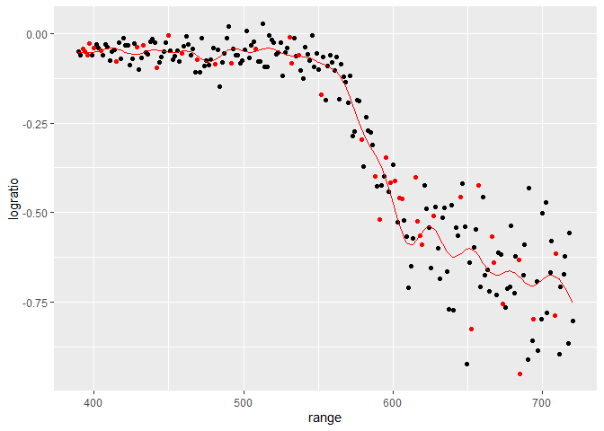
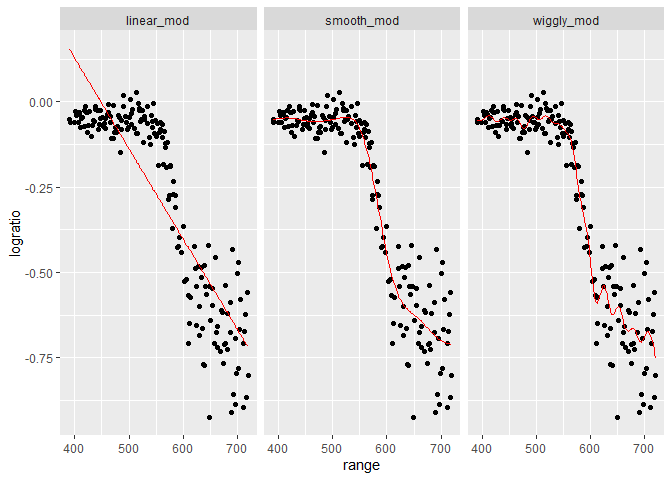

Cross Validation
================
Chenyu Jin
2024-11-07

``` r
library(tidyverse)
```

    ## ── Attaching core tidyverse packages ──────────────────────── tidyverse 2.0.0 ──
    ## ✔ dplyr     1.1.4     ✔ readr     2.1.5
    ## ✔ forcats   1.0.0     ✔ stringr   1.5.1
    ## ✔ ggplot2   3.5.1     ✔ tibble    3.2.1
    ## ✔ lubridate 1.9.3     ✔ tidyr     1.3.1
    ## ✔ purrr     1.0.2     
    ## ── Conflicts ────────────────────────────────────────── tidyverse_conflicts() ──
    ## ✖ dplyr::filter() masks stats::filter()
    ## ✖ dplyr::lag()    masks stats::lag()
    ## ℹ Use the conflicted package (<http://conflicted.r-lib.org/>) to force all conflicts to become errors

``` r
library(modelr)
library(mgcv)
```

    ## Loading required package: nlme
    ## 
    ## Attaching package: 'nlme'
    ## 
    ## The following object is masked from 'package:dplyr':
    ## 
    ##     collapse
    ## 
    ## This is mgcv 1.9-1. For overview type 'help("mgcv-package")'.

``` r
library(SemiPar)
```

    ## Warning: package 'SemiPar' was built under R version 4.4.2

``` r
set.seed(1)
```

``` r
data(lidar)

lidar_df = 
  lidar |> 
  as_tibble() |>
  mutate(id = row_number())

lidar_df |> 
  ggplot(aes(x = range, y = logratio)) + 
  geom_point()
```

<!-- -->

``` r
train_df = sample_frac(lidar_df, size = .8)
test_df = anti_join(lidar_df, train_df, by = "id")

ggplot(train_df, aes(x = range, y = logratio)) + 
  geom_point() + 
  geom_point(data = test_df, color = "red")
```

<!-- -->

``` r
linear_mod = lm(logratio ~ range, data = train_df)
smooth_mod = mgcv::gam(logratio ~ s(range), data = train_df)
wiggly_mod = mgcv::gam(logratio ~ s(range, k = 30), sp = 10e-6, data = train_df)
```

Look at fits

``` r
train_df |> 
  add_predictions(linear_mod) |> 
  ggplot(aes(x = range, y = logratio)) + 
  geom_point() + 
  geom_line(aes(y = pred), color = "red")+ 
  geom_point(data = test_df, color = "red")
```

<!-- -->

``` r
train_df |> 
  add_predictions(smooth_mod) |> 
  ggplot(aes(x = range, y = logratio)) + 
  geom_point() + 
  geom_line(aes(y = pred), color = "red")+ 
  geom_point(data = test_df, color = "red")
```

<!-- -->

``` r
train_df |> 
  add_predictions(wiggly_mod) |> 
  ggplot(aes(x = range, y = logratio)) + 
  geom_point() + 
  geom_line(aes(y = pred), color = "red")+ 
  geom_point(data = test_df, color = "red")
```

<!-- -->

``` r
train_df |> 
  gather_predictions(linear_mod, smooth_mod, wiggly_mod) |> 
  mutate(model = fct_inorder(model)) |> 
  ggplot(aes(x = range, y = logratio)) + 
  geom_point() + 
  geom_line(aes(y = pred), color = "red") + 
  facet_wrap(~model)
```

<!-- -->

``` r
rmse(linear_mod, test_df)
```

    ## [1] 0.127317

``` r
rmse(smooth_mod, test_df)
```

    ## [1] 0.08302008

``` r
rmse(wiggly_mod, test_df)
```

    ## [1] 0.08848557
