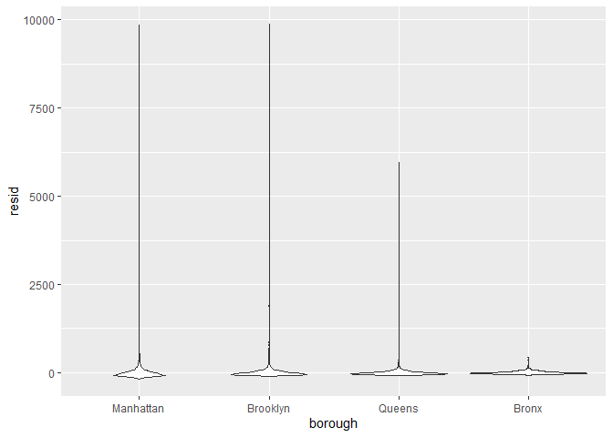

linear models
================
Chenyu Jin
2024-11-07

``` r
library(tidyverse)
```

    ## ── Attaching core tidyverse packages ──────────────────────── tidyverse 2.0.0 ──
    ## ✔ dplyr     1.1.4     ✔ readr     2.1.5
    ## ✔ forcats   1.0.0     ✔ stringr   1.5.1
    ## ✔ ggplot2   3.5.1     ✔ tibble    3.2.1
    ## ✔ lubridate 1.9.3     ✔ tidyr     1.3.1
    ## ✔ purrr     1.0.2     
    ## ── Conflicts ────────────────────────────────────────── tidyverse_conflicts() ──
    ## ✖ dplyr::filter() masks stats::filter()
    ## ✖ dplyr::lag()    masks stats::lag()
    ## ℹ Use the conflicted package (<http://conflicted.r-lib.org/>) to force all conflicts to become errors

``` r
library(p8105.datasets)
```

Do some data cleaning

``` r
data("nyc_airbnb")

nyc_airbnb = 
  nyc_airbnb |> 
  mutate(stars = review_scores_location / 2) |> 
  rename(
    borough = neighbourhood_group,
    neighborhood = neighbourhood) |> 
  filter(borough != "Staten Island") |> 
  select(price, stars, borough, neighborhood, room_type)
```

## Fit some models

``` r
fit = lm(price ~ stars + borough, data = nyc_airbnb)
```

Try a bit more complex

``` r
nyc_airbnb = 
  nyc_airbnb |> 
  mutate(
    borough = fct_infreq(borough),
    room_type = fct_infreq(room_type))

fit = lm(price ~ stars + borough, data = nyc_airbnb)
```

Tidying output

``` r
summary(fit)
```

    ## 
    ## Call:
    ## lm(formula = price ~ stars + borough, data = nyc_airbnb)
    ## 
    ## Residuals:
    ##    Min     1Q Median     3Q    Max 
    ## -169.8  -64.0  -29.0   20.2 9870.0 
    ## 
    ## Coefficients:
    ##                 Estimate Std. Error t value Pr(>|t|)    
    ## (Intercept)       19.839     12.189   1.628    0.104    
    ## stars             31.990      2.527  12.657   <2e-16 ***
    ## boroughBrooklyn  -49.754      2.235 -22.262   <2e-16 ***
    ## boroughQueens    -77.048      3.727 -20.675   <2e-16 ***
    ## boroughBronx     -90.254      8.567 -10.534   <2e-16 ***
    ## ---
    ## Signif. codes:  0 '***' 0.001 '**' 0.01 '*' 0.05 '.' 0.1 ' ' 1
    ## 
    ## Residual standard error: 181.5 on 30525 degrees of freedom
    ##   (9962 observations deleted due to missingness)
    ## Multiple R-squared:  0.03423,    Adjusted R-squared:  0.03411 
    ## F-statistic: 270.5 on 4 and 30525 DF,  p-value: < 2.2e-16

``` r
summary(fit)$coef
```

    ##                  Estimate Std. Error    t value      Pr(>|t|)
    ## (Intercept)      19.83946  12.189256   1.627619  1.036160e-01
    ## stars            31.98989   2.527500  12.656733  1.269392e-36
    ## boroughBrooklyn -49.75363   2.234878 -22.262345 6.317605e-109
    ## boroughQueens   -77.04776   3.726632 -20.674904  2.584908e-94
    ## boroughBronx    -90.25393   8.567490 -10.534465  6.638618e-26

``` r
coef(fit)
```

    ##     (Intercept)           stars boroughBrooklyn   boroughQueens    boroughBronx 
    ##        19.83946        31.98989       -49.75363       -77.04776       -90.25393

``` r
fit |> 
  broom::glance()
```

    ## # A tibble: 1 × 12
    ##   r.squared adj.r.squared sigma statistic   p.value    df   logLik    AIC    BIC
    ##       <dbl>         <dbl> <dbl>     <dbl>     <dbl> <dbl>    <dbl>  <dbl>  <dbl>
    ## 1    0.0342        0.0341  182.      271. 6.73e-229     4 -202113. 4.04e5 4.04e5
    ## # ℹ 3 more variables: deviance <dbl>, df.residual <int>, nobs <int>

``` r
fit |> 
  broom::tidy()
```

    ## # A tibble: 5 × 5
    ##   term            estimate std.error statistic   p.value
    ##   <chr>              <dbl>     <dbl>     <dbl>     <dbl>
    ## 1 (Intercept)         19.8     12.2       1.63 1.04e-  1
    ## 2 stars               32.0      2.53     12.7  1.27e- 36
    ## 3 boroughBrooklyn    -49.8      2.23    -22.3  6.32e-109
    ## 4 boroughQueens      -77.0      3.73    -20.7  2.58e- 94
    ## 5 boroughBronx       -90.3      8.57    -10.5  6.64e- 26

``` r
fit |> 
  broom::tidy() |> 
  select(term, estimate, p.value) |> 
  mutate(term = str_replace(term, "^borough", "Borough: ")) |> 
  knitr::kable(digits = 3)
```

| term              | estimate | p.value |
|:------------------|---------:|--------:|
| (Intercept)       |   19.839 |   0.104 |
| stars             |   31.990 |   0.000 |
| Borough: Brooklyn |  -49.754 |   0.000 |
| Borough: Queens   |  -77.048 |   0.000 |
| Borough: Bronx    |  -90.254 |   0.000 |

## Diagnostics

``` r
modelr::add_residuals(nyc_airbnb, fit)
```

    ## # A tibble: 40,492 × 6
    ##    price stars borough neighborhood room_type        resid
    ##    <dbl> <dbl> <fct>   <chr>        <fct>            <dbl>
    ##  1    99   5   Bronx   City Island  Private room      9.47
    ##  2   200  NA   Bronx   City Island  Private room     NA   
    ##  3   300  NA   Bronx   City Island  Entire home/apt  NA   
    ##  4   125   5   Bronx   City Island  Entire home/apt  35.5 
    ##  5    69   5   Bronx   City Island  Private room    -20.5 
    ##  6   125   5   Bronx   City Island  Entire home/apt  35.5 
    ##  7    85   5   Bronx   City Island  Entire home/apt  -4.53
    ##  8    39   4.5 Bronx   Allerton     Private room    -34.5 
    ##  9    95   5   Bronx   Allerton     Entire home/apt   5.47
    ## 10   125   4.5 Bronx   Allerton     Entire home/apt  51.5 
    ## # ℹ 40,482 more rows

``` r
modelr::add_predictions(nyc_airbnb, fit)
```

    ## # A tibble: 40,492 × 6
    ##    price stars borough neighborhood room_type        pred
    ##    <dbl> <dbl> <fct>   <chr>        <fct>           <dbl>
    ##  1    99   5   Bronx   City Island  Private room     89.5
    ##  2   200  NA   Bronx   City Island  Private room     NA  
    ##  3   300  NA   Bronx   City Island  Entire home/apt  NA  
    ##  4   125   5   Bronx   City Island  Entire home/apt  89.5
    ##  5    69   5   Bronx   City Island  Private room     89.5
    ##  6   125   5   Bronx   City Island  Entire home/apt  89.5
    ##  7    85   5   Bronx   City Island  Entire home/apt  89.5
    ##  8    39   4.5 Bronx   Allerton     Private room     73.5
    ##  9    95   5   Bronx   Allerton     Entire home/apt  89.5
    ## 10   125   4.5 Bronx   Allerton     Entire home/apt  73.5
    ## # ℹ 40,482 more rows

``` r
nyc_airbnb |> 
  modelr::add_residuals(fit) |> 
  ggplot(aes(x = borough, y = resid)) + geom_violin()
```

    ## Warning: Removed 9962 rows containing non-finite outside the scale range
    ## (`stat_ydensity()`).

<!-- -->

``` r
nyc_airbnb |> 
  modelr::add_residuals(fit) |> 
  ggplot(aes(x = stars, y = resid)) + geom_point()
```

    ## Warning: Removed 9962 rows containing missing values or values outside the scale range
    ## (`geom_point()`).

<!-- -->

## Hypothesis testing

``` r
fit |>
  broom::tidy()
```

    ## # A tibble: 5 × 5
    ##   term            estimate std.error statistic   p.value
    ##   <chr>              <dbl>     <dbl>     <dbl>     <dbl>
    ## 1 (Intercept)         19.8     12.2       1.63 1.04e-  1
    ## 2 stars               32.0      2.53     12.7  1.27e- 36
    ## 3 boroughBrooklyn    -49.8      2.23    -22.3  6.32e-109
    ## 4 boroughQueens      -77.0      3.73    -20.7  2.58e- 94
    ## 5 boroughBronx       -90.3      8.57    -10.5  6.64e- 26

``` r
fit_null = lm(price ~ stars + borough, data = nyc_airbnb)

fit_null |>
  broom::tidy()
```

    ## # A tibble: 5 × 5
    ##   term            estimate std.error statistic   p.value
    ##   <chr>              <dbl>     <dbl>     <dbl>     <dbl>
    ## 1 (Intercept)         19.8     12.2       1.63 1.04e-  1
    ## 2 stars               32.0      2.53     12.7  1.27e- 36
    ## 3 boroughBrooklyn    -49.8      2.23    -22.3  6.32e-109
    ## 4 boroughQueens      -77.0      3.73    -20.7  2.58e- 94
    ## 5 boroughBronx       -90.3      8.57    -10.5  6.64e- 26

``` r
fit_alt = lm(price ~ stars + borough + room_type, data = nyc_airbnb)

fit_alt |>
  broom::tidy()
```

    ## # A tibble: 7 × 5
    ##   term                  estimate std.error statistic  p.value
    ##   <chr>                    <dbl>     <dbl>     <dbl>    <dbl>
    ## 1 (Intercept)              113.      11.8       9.54 1.56e-21
    ## 2 stars                     21.9      2.43      9.01 2.09e-19
    ## 3 boroughBrooklyn          -40.3      2.15    -18.8  4.62e-78
    ## 4 boroughQueens            -55.5      3.59    -15.4  1.32e-53
    ## 5 boroughBronx             -63.0      8.22     -7.67 1.76e-14
    ## 6 room_typePrivate room   -105.       2.05    -51.2  0       
    ## 7 room_typeShared room    -129.       6.15    -21.0  2.24e-97

``` r
anova(fit_null, fit_alt) |> 
  broom::tidy()
```

    ## # A tibble: 2 × 7
    ##   term                        df.residual    rss    df   sumsq statistic p.value
    ##   <chr>                             <dbl>  <dbl> <dbl>   <dbl>     <dbl>   <dbl>
    ## 1 price ~ stars + borough           30525 1.01e9    NA NA            NA       NA
    ## 2 price ~ stars + borough + …       30523 9.21e8     2  8.42e7     1394.       0

## Nesting data

``` r
nyc_airbnb |> 
  lm(price ~ stars * borough + room_type * borough, data = _) |> 
  broom::tidy() |> 
  knitr::kable(digits = 3)
```

| term                                  | estimate | std.error | statistic | p.value |
|:--------------------------------------|---------:|----------:|----------:|--------:|
| (Intercept)                           |   95.694 |    19.184 |     4.988 |   0.000 |
| stars                                 |   27.110 |     3.965 |     6.838 |   0.000 |
| boroughBrooklyn                       |  -26.066 |    25.080 |    -1.039 |   0.299 |
| boroughQueens                         |   -4.118 |    40.674 |    -0.101 |   0.919 |
| boroughBronx                          |   -5.627 |    77.808 |    -0.072 |   0.942 |
| room_typePrivate room                 | -124.188 |     2.996 |   -41.457 |   0.000 |
| room_typeShared room                  | -153.635 |     8.692 |   -17.676 |   0.000 |
| stars:boroughBrooklyn                 |   -6.139 |     5.237 |    -1.172 |   0.241 |
| stars:boroughQueens                   |  -17.455 |     8.539 |    -2.044 |   0.041 |
| stars:boroughBronx                    |  -22.664 |    17.099 |    -1.325 |   0.185 |
| boroughBrooklyn:room_typePrivate room |   31.965 |     4.328 |     7.386 |   0.000 |
| boroughQueens:room_typePrivate room   |   54.933 |     7.459 |     7.365 |   0.000 |
| boroughBronx:room_typePrivate room    |   71.273 |    18.002 |     3.959 |   0.000 |
| boroughBrooklyn:room_typeShared room  |   47.797 |    13.895 |     3.440 |   0.001 |
| boroughQueens:room_typeShared room    |   58.662 |    17.897 |     3.278 |   0.001 |
| boroughBronx:room_typeShared room     |   83.089 |    42.451 |     1.957 |   0.050 |

``` r
nest_lm_res =
  nyc_airbnb |> 
  nest(data = -borough) |> 
  mutate(
    models = map(data, \(df) lm(price ~ stars + room_type, data = df)),
    results = map(models, broom::tidy)) |> 
  select(-data, -models) |> 
  unnest(results)
```

``` r
nest_lm_res |> 
  select(borough, term, estimate) |> 
  mutate(term = fct_inorder(term)) |> 
  pivot_wider(
    names_from = term, values_from = estimate) |> 
  knitr::kable(digits = 3)
```

| borough   | (Intercept) |  stars | room_typePrivate room | room_typeShared room |
|:----------|------------:|-------:|----------------------:|---------------------:|
| Bronx     |      90.067 |  4.446 |               -52.915 |              -70.547 |
| Queens    |      91.575 |  9.654 |               -69.255 |              -94.973 |
| Brooklyn  |      69.627 | 20.971 |               -92.223 |             -105.839 |
| Manhattan |      95.694 | 27.110 |              -124.188 |             -153.635 |

``` r
manhattan_airbnb =
  nyc_airbnb |> 
  filter(borough == "Manhattan")

manhattan_nest_lm_res =
  manhattan_airbnb |> 
  nest(data = -neighborhood) |> 
  mutate(
    models = map(data, \(df) lm(price ~ stars + room_type, data = df)),
    results = map(models, broom::tidy)) |> 
  select(-data, -models) |> 
  unnest(results)
```

``` r
manhattan_nest_lm_res |> 
  filter(str_detect(term, "room_type")) |> 
  ggplot(aes(x = neighborhood, y = estimate)) + 
  geom_point() + 
  facet_wrap(~term) + 
  theme(axis.text.x = element_text(angle = 80, hjust = 1))
```

<!-- -->
